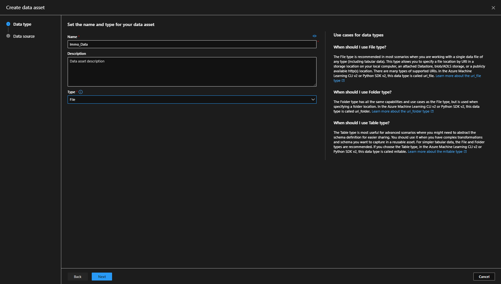
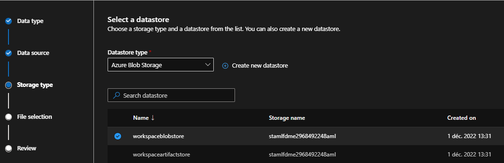
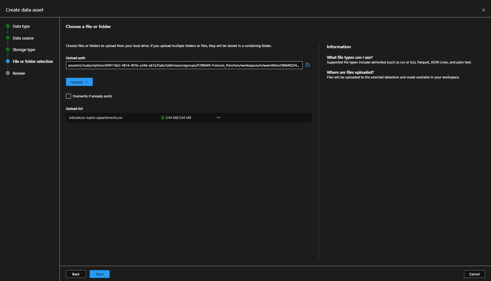
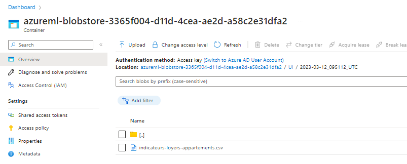
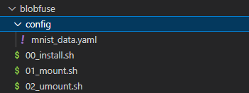
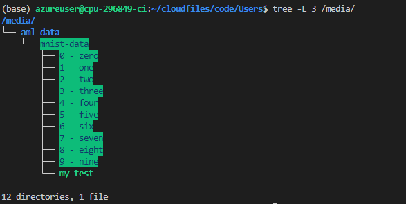

# Data and Storage

## Introduction
In this part we'll talk about how to use Data in AzureML.

## Use Managed File
The file dataset is a way to upload data in AzureML.
For that, you can go to the **Data** tab of AzureML.

For the example, we'll use the CLI v1.

Let's create a new dataset:



Upload a new file :







Bellow the hood, the file is copied in the default datastore.



In order to consume the file, there is different way we won't detail here.
We'll view it when we'll talk about pipelines.

Anyway, there is one thing that is important. In CLI v2.0 you won't be able to consume the file out of a pipeline...
| version | version |How     | Consumable|
|---------|---------|--------|-----------|
|File     | CLI v1  |Instance| Yes       |
|File     | CLI v2  |Instance| Not       |
|File     | Both    |Pipeline| Yes       |

Personnally i rarely use this option, i prefer using Managed Datastore.
But it's a releavant solution if you work with notebooks.

## Use Manage Datastore
Often, your data will be consumed from an external storage source.
But before doing this, we'll have to focus a little on how to upload data on such storage !

For that, we'll play with MNIST dataset, in order to do it.
### Create the storage account

In order to upload data, we'll first have to create a container...

Azure Ressource Group>> Storage Account<br>
Create a new container **mnist-data-YOUR-ID**


Replace **\<CONTAINER NAME>** by **mnist-data-YOUR-ID>** and create the container.

Once the container is created, we'll have to declare it in AzureML, for that, we'll go in the **data** tab.<br>
Click on **Datastores**, normally, you'll see this screen :


Now, you can add this container to AzureML, but for that, you'll need the account key.
Go back to the storage account, and get it's **Account Key**, make sure you copied it.


Once done, you can go back in AzureML Workspace and add a new link to the datastore. Paste the Account key in the red part.


Once done, you'll be able to see the content of your storage in your workspace. (for the moment it's empty).<br>


Now, we are ready to go back in AzureML !

# Upload data

In order to upload data manually in your storage, you have different options we won't detail here.<br>
- Use **Azure Storage Explorer** - [Doc MS](https://azure.microsoft.com/fr-fr/products/storage/storage-explorer) | [Doc Michelin](https://michelingroup.sharepoint.com/sites/ExplorationManufacturing/SitePages/AzureStorageExplorer_en.aspx)
- Use **Azure Blob SDK** - [Doc MS](https://learn.microsoft.com/en-us/python/api/overview/azure/storage?view=azure-python) | [Doc Michelin](https://michelingroup.sharepoint.com/sites/ExplorationManufacturing/SitePages/AzureStorage_SDK.aspx)

We'll talk a little about blobfuse because it's a very convenient tool when you'll want to debug your pipeline.

# Consume your data

## BlobFuse2 - Mount your storage
Create a **blobfuse** directory in your arborescence.
Under this directory, create a **00_install.sh** file.

<div style="background-color:#0000EE22">
IN WSL - 00_install.sh<br>
</div>

```bash
# Install repository
wget https://packages.microsoft.com/config/ubuntu/20.04/packages-microsoft-prod.deb
sudo dpkg -i packages-microsoft-prod.deb
sudo apt-get update
# Install dependancies
sudo apt-get install libfuse3-dev fuse3
# Install Blobfuse2
sudo apt install blobfuse2
```

Run this script with this command in a terminal...
```bash
# Install repository
sh blobfuse/00_install.sh 
```

Create a **config** dir inside blobfuse and a file **mnist_data** in it.

<div style="background-color:#0000EE22">
IN WSL - config/mnist_data.yaml<br>
</div>

```yaml
# Refer ./setup/baseConfig.yaml for full set of config parameters
allow-other: true

logging:
  type: syslog
  level: log_debug

components:
  - libfuse
  - file_cache
  - attr_cache
  - azstorage

libfuse:
  attribute-expiration-sec: 120
  entry-expiration-sec: 120
  negative-entry-expiration-sec: 240

file_cache:
  # Define the cache size / place
  path: /tmp/.azcache
  timeout-sec: 120
  max-size-mb: 512

attr_cache:
  timeout-sec: 7200

azstorage:
  type: block
  # Enable virtual directory => Important to discover well files
  virtual-directory : true
  account-name: <STORAGE NAME>
  endpoint: https://<STORAGE NAME>.blob.core.windows.net
  # mode possible : key|sas|spn|msi
  mode: key
  account-key: <ACCOUNTKEY>

mountall:
  # allowlist takes precedence over denylist in case of conflicts
  container-allowlist:
    - mnist-data-YOUR-ID


```

Of course, replace your storage account_name / container_name / endpoint and account key to be the one corresponding to your storage.

Once done, create a **01_mount.sh** and a **02_umount.sh** script :
<div style="background-color:#0000EE22">
IN WSL - 01_mount.sh<br>
</div>

```bash
sudo mkdir /media/aml_data
sudo mkdir /tmp/.azcache
# Replace myuser by your user, in my case f296849
sudo chown azureuser /media/aml_data
sudo chown azureuser /tmp/.azcache
sudo blobfuse2 mount all /media/aml_data/ --config-file="blobfuse/config/mnist_data.yaml"
```

<div style="background-color:#0000EE22">
IN WSL - 02_umount.sh<br>
</div>

```bash
# Unmount All
sudo blobfuse2 unmount all
```

The arborescence should look like that :




Run mount.sh script
```bash
# Install repository
sh blobfuse/01_mount.sh 
```
Let's try it :
```bash
# create a new file in mnist_data...
touch /media/aml_data/mnist-data/my_test 
# list all file in /media...
tree -L 3 /media/
```



We can see that :
- we have mount our storage
- we have a read/write access to the datastore !

---
[<< Back](../README.md)